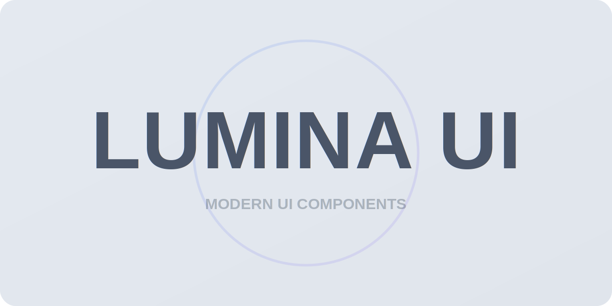

# Lumina UI React

<div align="center">
  
  <p><strong>A modern, visually stunning UI component library for React with rich theming and interactive components</strong></p>
  
  <a href="https://github.com/CodeAadarsh/Lumina-UI/blob/main/LICENSE">
    
  </a>
  
  
</div>

<br/>

## ✨ Features

- 🎨 **Multiple Themes** - Enterprise, TechDark, Glass, and Neumorphic light/dark themes
- 💫 **Interactive Effects** - 3D cards, motion effects, parallax scrolling, spotlight effects
- 🌈 **Visual Appeal** - Gradients, glows, glass effects, and more
- 💅 **Fully Customizable** - Tailwind CSS powered with CSS variables
- 📦 **Tree-shakeable** - Import only what you need
- 🚀 **Performant** - Optimized for speed and efficiency
- 📱 **Responsive** - Mobile-first design
- 🎬 **Animated** - Beautiful animations and transitions
- 🔍 **TypeScript Support** - Full type definitions for enhanced developer experience

## 📦 Installation

```bash
# npm
npm install lumina-ui-react

# yarn
yarn add lumina-ui-react

# pnpm
pnpm add lumina-ui-react
```

## 🚀 Quick Start

```jsx
import { ThemeProvider, Button, Card, MotionCard } from 'lumina-ui-react';
import "lumina-ui-react/dist/lumina-ui-react.css";

function App() {
  return (
    <ThemeProvider theme="techDark">
      <div className="p-8">
        <MotionCard 
          variant="glass-premium" 
          glow="medium" 
          highlight="subtle" 
          rounded="xl"
        >
          <Card>
            <CardHeader>
              <CardTitle>Welcome to Lumina UI</CardTitle>
              <CardDescription>A modern UI library for React</CardDescription>
            </CardHeader>
            <CardContent>
              <p>Build stunning interfaces with ease</p>
            </CardContent>
            <CardFooter>
              <Button variant="primary" effect="glow">Get Started</Button>
            </CardFooter>
          </Card>
        </MotionCard>
      </div>
    </ThemeProvider>
  );
}
```

## ⚠️ Important Usage Notes

### CSS Import

Make sure to import the CSS file:

```jsx
// Import the CSS file in your entry point
import "lumina-ui-react/dist/lumina-ui-react.css";

// OR use the shorter alias
import "lumina-ui-react/styles";
```

### Compound Components Pattern

Many components in Lumina UI use the compound components pattern for better organization and flexibility:

```jsx
// CORRECT way to use compound components
<Card>
  <CardHeader>
    <CardTitle>Card Title</CardTitle>
  </CardHeader>
  <CardContent>Content here</CardContent>
</Card>

// Don't try to import sub-components directly
// This WON'T work:
import { CardHeader } from 'lumina-ui-react';
```

## 🎨 Themes and Styling

Lumina UI includes multiple beautiful themes that can be easily switched:

```jsx
import { ThemeProvider, useTheme, Button } from 'lumina-ui-react';

function ThemeSwitcher() {
  const { theme, setTheme } = useTheme();
  
  return (
    <div className="flex space-x-2">
      <Button 
        variant={theme === 'enterprise' ? 'primary' : 'outline'}
        onClick={() => setTheme('enterprise')}
      >
        Enterprise
      </Button>
      
      <Button 
        variant={theme === 'techDark' ? 'primary' : 'outline'}
        onClick={() => setTheme('techDark')}
      >
        Tech Dark
      </Button>
      
      <Button 
        variant={theme === 'glass' ? 'primary' : 'outline'}
        onClick={() => setTheme('glass')}
      >
        Glass
      </Button>
      
      <Button 
        variant={theme === 'neumorphicLight' ? 'primary' : 'outline'}
        onClick={() => setTheme('neumorphicLight')}
      >
        Neumorphic
      </Button>
    </div>
  );
}

// Wrap your app with ThemeProvider
function App() {
  return (
    <ThemeProvider defaultTheme="enterprise">
      <ThemeSwitcher />
      {/* Your app content */}
    </ThemeProvider>
  );
}
```

## 🧩 Component Showcase

### Core Components

<details>
<summary><strong>Button</strong> - Versatile button component with multiple variants and effects</summary>

```jsx
import { Button } from 'lumina-ui-react';

// Basic buttons
<Button>Default Button</Button>
<Button variant="primary">Primary</Button>
<Button variant="secondary">Secondary</Button>
<Button variant="outline">Outline</Button>
<Button variant="ghost">Ghost</Button>

// With effects
<Button effect="glow">Glow Effect</Button>
<Button effect="pulse">Pulse Effect</Button>
<Button variant="primary" effect="shimmer">Shimmer Effect</Button>

// Size variants
<Button size="sm">Small</Button>
<Button size="md">Medium</Button>
<Button size="lg">Large</Button>

// Icon buttons
<Button leftIcon={<Icon/>}>With Icon</Button>
<Button rightIcon={<Icon/>}>Icon Right</Button>
<Button iconOnly={<Icon/>} aria-label="Settings" />
```
</details>

<details>
<summary><strong>Input</strong> - Text input with various styles and states</summary>

```jsx
import { Input } from 'lumina-ui-react';
import { Mail, Lock } from 'lucide-react';

// Basic input
<Input label="Username" placeholder="Enter your username" />

// Input with icon
<Input 
  label="Email" 
  placeholder="Enter your email" 
  leftIcon={<Mail size={18} />} 
/>

// Password input with toggle
<Input 
  type="password" 
  label="Password" 
  placeholder="Enter your password" 
  leftIcon={<Lock size={18} />}
  showPasswordToggle
/>

// Input states
<Input label="Normal" placeholder="Normal state" />
<Input label="Disabled" placeholder="Disabled state" disabled />
<Input label="Error" placeholder="Error state" error="This field is required" />
<Input label="Success" placeholder="Success state" success="Username is available" />

// Variants
<Input variant="filled" label="Filled Input" />
<Input variant="outline" label="Outline Input" />
<Input variant="glass" label="Glass Input" />
<Input variant="neumorphic-light" label="Neumorphic Light" />
<Input variant="neumorphic-dark" label="Neumorphic Dark" />

// Special features
<Input label="Clearable" placeholder="Type and clear" clearable />
<Input label="With Helper" placeholder="Input with helper text" helperText="This is helper text" />
<Input label="Name" placeholder="Floating label" floatingLabel />
```
</details>

<details>
<summary><strong>Card</strong> - Flexible card component with header, content, footer sub-components</summary>

```jsx
import { Card, Button } from 'lumina-ui-react';

<Card>
  <CardHeader>
    <CardTitle>Card Title</CardTitle>
    <CardDescription>This is a description of the card</CardDescription>
  </CardHeader>
  <CardContent>
    <p>This is the main content of the card. You can put anything here.</p>
  </CardContent>
  <CardFooter>
    <Button>Action</Button>
  </CardFooter>
</Card>
```
</details>

### Interactive Effect Components

<details>
<summary><strong>MotionCard</strong> - 3D motion card with interactive effects</summary>

```jsx
import { MotionCard, MotionCardContent, MotionCardLayer } from 'lumina-ui-react';

// Basic usage
<MotionCard>
  <MotionCardContent>
    <h3>Motion Card</h3>
    <p>Move your cursor to see the 3D effect</p>
  </MotionCardContent>
</MotionCard>

// With variants and effects
<MotionCard 
  variant="glass-premium"
  intensity="medium"
  rounded="xl"
  glow="medium"
  highlight="subtle"
>
  <MotionCardContent>
    <h3>Premium Glass Card</h3>
    <p>With glow and highlight effects</p>
  </MotionCardContent>
</MotionCard>

// With layered content for enhanced 3D effect
<MotionCard variant="elevated" rounded="lg">
  <MotionCardContent>
    <MotionCardLayer depth={40}>
      <div className="w-16 h-16 rounded-full bg-blue-500 mb-4"></div>
    </MotionCardLayer>
    
    <MotionCardLayer depth={20}>
      <h3 className="text-xl font-bold">Layered Content</h3>
    </MotionCardLayer>
    
    <MotionCardLayer depth={10}>
      <p>Each layer has a different depth in 3D space</p>
    </MotionCardLayer>
  </MotionCardContent>
</MotionCard>
```
</details>

<details>
<summary><strong>Spotlight</strong> - Interactive spotlight effect following cursor</summary>

```jsx
import { Spotlight } from 'lumina-ui-react';

// Basic usage
<Spotlight>
  <div className="text-center p-20">
    <h2 className="text-2xl font-bold mb-4">Spotlight Effect</h2>
    <p>Move your cursor around to see the spotlight follow</p>
  </div>
</Spotlight>

// With variants and effects
<Spotlight 
  theme="glass"
  size="lg"
  spotSize="lg"
  intensity="medium"
  color="purple"
  type="radial"
>
  <div className="text-center p-20">
    <h2 className="text-2xl font-bold mb-4 text-white">Glass Theme Spotlight</h2>
    <p className="text-white/80">With purple color and medium intensity</p>
  </div>
</Spotlight>

// Animation effects
<Spotlight 
  animation="rainbow"
  color="multi"
>
  <div className="text-center p-20">
    <h2 className="text-2xl font-bold mb-4">Rainbow Animation</h2>
    <p>With multi-color cycling effect</p>
  </div>
</Spotlight>
```
</details>

<details>
<summary><strong>TextGenerateEffect</strong> - Text animation with typewriter effect</summary>

```jsx
import { TextGenerateEffect } from 'lumina-ui-react';

// Basic usage
<TextGenerateEffect words="This text will be typed out character by character." />

// With styling and effects
<TextGenerateEffect 
  words="Interactive text with gradient effect"
  theme="techDark"
  size="2xl"
  weight="bold"
  effect="gradient"
  speed="normal"
/>

// With callback and looping
<TextGenerateEffect 
  words="This text will loop continuously."
  loop
  speed="fast"
  onComplete={() => console.log('Animation completed')}
/>
```
</details>

<details>
<summary><strong>HeroGrid</strong> - Grid-based hero sections with various layouts</summary>

```jsx
import { HeroGrid } from 'lumina-ui-react';

// Classic layout
<HeroGrid layout="classic" spacing="relaxed">
  <HeroGridContent>
    <HeroGridTitle>Welcome to Our Platform</HeroGridTitle>
    <HeroGridSubtitle>The best solution for your needs</HeroGridSubtitle>
    <p>Detailed description goes here...</p>
    <HeroGridActions>
      <button className="px-6 py-3 bg-blue-500 text-white rounded-lg">Get Started</button>
      <button className="px-6 py-3 border border-blue-500 text-blue-500 rounded-lg">Learn More</button>
    </HeroGridActions>
  </HeroGridContent>
  
  <HeroGridMedia imageUrl="path/to/image.jpg" alt="Hero image" />
</HeroGrid>

// Centered layout
<HeroGrid layout="centered" spacing="spacious">
  <HeroGridContent>
    <HeroGridTitle>Centered Hero Layout</HeroGridTitle>
    <HeroGridSubtitle>Perfect for focused messaging</HeroGridSubtitle>
    <p>Content here is centered for maximum impact...</p>
    <HeroGridActions>
      <button className="px-6 py-3 bg-blue-500 text-white rounded-lg">Primary Action</button>
    </HeroGridActions>
  </HeroGridContent>
</HeroGrid>

// With background image
<HeroGrid 
  layout="asymmetric" 
  background="image" 
  backgroundImage="path/to/background.jpg"
>
  <HeroGridContent>
    <HeroGridTitle>Hero with Background</HeroGridTitle>
    <HeroGridSubtitle>Stunning visuals with overlay</HeroGridSubtitle>
    <p>Content here is shown over a background image...</p>
  </HeroGridContent>
  
  <HeroGridMedia>
    <div className="p-6 bg-white/10 backdrop-blur-md rounded-xl">
      <h3>Card Content</h3>
      <p>This content is shown in the asymmetric second column</p>
    </div>
  </HeroGridMedia>
</HeroGrid>
```
</details>

### More Components

Lumina UI includes many more components such as:

- **BentoGrid** - Masonry-style grid layout for content organization
- **Carousel** - Animated carousel for content rotation
- **Testimonial3D** - 3D testimonial display with hover effects
- **AnimatedTestimonialSlider** - Animated sliders for testimonials
- **Modal** - Customizable modal dialogs with animations
- **ScrollMotion** - Components for scroll-based animations
- **ScratchCard** - Interactive scratch card effect
- **Header** - Responsive header component with navigation support

## 🔧 Customization

Lumina UI is built with customization in mind. You can easily override default styles:

```jsx
// Customizing a component with className prop
<Button 
  className="custom-button-class" 
  variant="primary"
>
  Custom Button
</Button>

// Using the cn utility for conditional classes
import { cn } from 'lumina-ui-react';

<div className={cn(
  "base-class", 
  isActive && "active-class",
  variant === "special" && "special-class"
)}>
  Conditional Classes
</div>
```

## 🔍 TypeScript Support

Lumina UI is built with TypeScript and provides comprehensive type definitions:

```tsx
import { Button, ButtonProps } from 'lumina-ui-react';

// TypeScript will provide autocomplete and type checking
const CustomButton = ({ children, ...props }: ButtonProps) => (
  <Button variant="primary" effect="glow" {...props}>
    {children}
  </Button>
);
```

## 🎮 Component Variants

Most components support variants through the CVA (class-variance-authority) pattern:

```tsx
import { Button, MotionCard, Spotlight } from 'lumina-ui-react';

// Button variants
<Button variant="primary">Primary</Button>
<Button variant="secondary">Secondary</Button>
<Button variant="outline">Outline</Button>

// MotionCard variants
<MotionCard variant="default">Default</MotionCard>
<MotionCard variant="elevated">Elevated</MotionCard>
<MotionCard variant="glass">Glass</MotionCard>
<MotionCard variant="neumorphic-light">Neumorphic</MotionCard>

// Spotlight variants
<Spotlight type="radial">Radial</Spotlight>
<Spotlight type="directional">Directional</Spotlight>
<Spotlight type="beam">Beam</Spotlight>
```

## 🔧 Troubleshooting

### Common Issues and Solutions

1. **CSS not loading**
   - Make sure to import the CSS file: `import "lumina-ui-react/dist/lumina-ui-react.css";`
   - Or use the shorter alias: `import "lumina-ui-react/styles";`

2. **Sub-component not found**
   - Always use sub-components through their parent component: `<CardHeader>` instead of importing `CardHeader` directly

3. **Theme not working**
   - Ensure you're using a supported theme: 'enterprise', 'techDark', 'glass', 'neumorphicLight'
   - Verify that the ThemeProvider wraps your components

4. **TypeScript errors**
   - Make sure you're using the latest version with TypeScript support
   - Import types correctly: `import { ButtonProps } from 'lumina-ui-react';`

## 📖 Documentation

For more detailed documentation, please visit our [GitHub repository](https://github.com/CodeAadarsh/Lumina-UI).

## 💻 Examples

Check out our example applications:

```bash
git clone https://github.com/CodeAadarsh/Lumina-UI
cd Lumina-UI
npm install
npm run storybook
```

## 🤝 Contributing

We welcome contributions! Please feel free to submit a Pull Request.
Check out [CONTRIBUTING](https://github.com/CodeAadarsh/Lumina-UI/blob/main/CONTRIBUTING.md)

## 📄 License

MIT © 2024 Lumina UI

## 💬 Support

- [GitHub Issues](https://github.com/CodeAadarsh/Lumina-UI/issues)

---

<div align="center">
  <p>Built with ❤️ by <a href="https://github.com/CodeAadarsh">Aadarsh Verma</a></p>
</div>